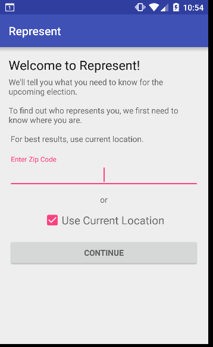
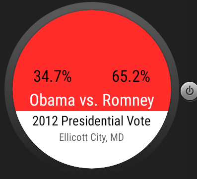

# PROG 02: Represent!
An app for the Android phone and Android wear devices that lets you view information on your congressional representatives as well as your county's voting record.

## Authors

Jasper Louie ([jasper.louie@berkeley.edu](mailto:jasper.louie@berkeley.edu))

## Demo Video

See a CS160 PROG-02C video demonstration (https://youtu.be/-qy_Qyaieys)

## Screenshots

## Acknowledgments
Some sample code I used:
Expandable Textviews: http://stackoverflow.com/questions/15627530/android-expandable-textview-with-animation
2dPicker: http://developer.android.com/training/wearables/ui/2d-picker.html
Makes use of Congressional API by SunlightFoundation, Google Geocode API, and Twitter API.
